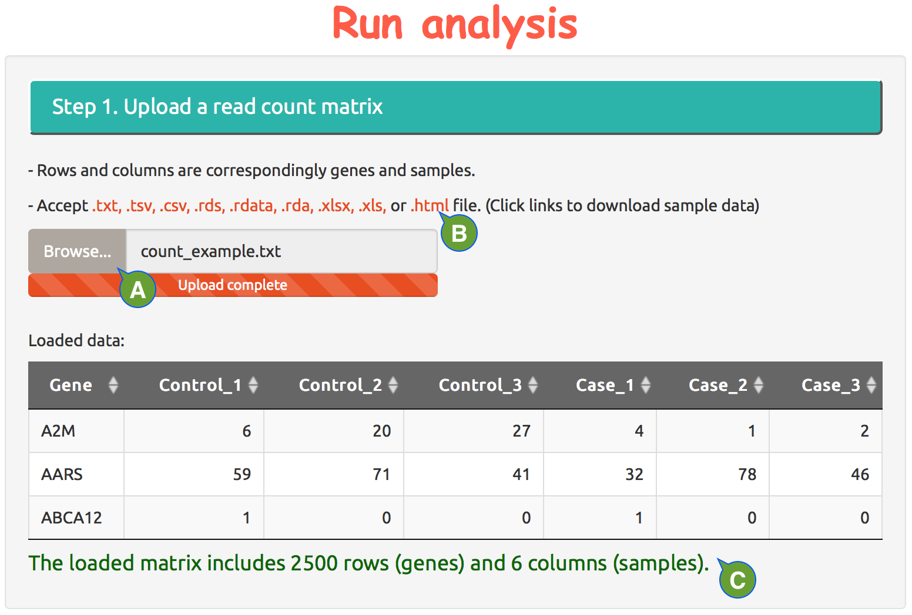

---
output:
  html_document:
    theme: null
    mathjax: null
---

**Set up online DE analysis, Step 1.**

Load read count matrix.

  - **A:** upload a local file of read count matrix in one of the acceptable formats.
  - **B:** click file extension to download an example file in acceptable format. 
  - **C:** once a read count matrix is successfully loaded, the first a few rows will be showed for visual confirmation.

