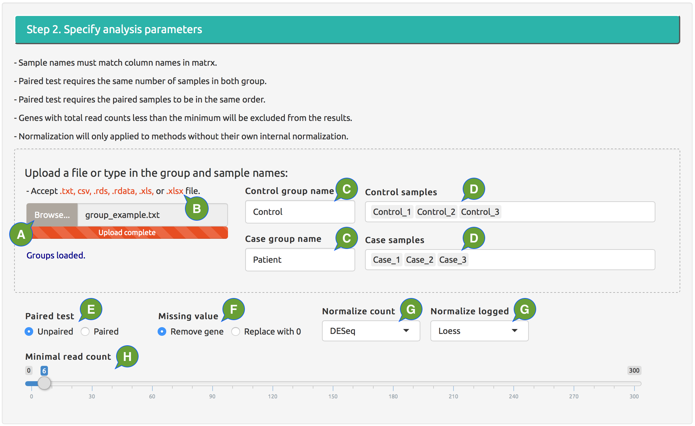

---
output:
  html_document:
    theme: null
    mathjax: null
---

<figure></figure>

**Figure 1B.** Set up online DE analysis, Step 2.

  - **A:** upload a local file of sample grouping in an acceptable formats; the group names and sample ID will show up in boxes on the right.
  - **B:** click file extension to download an example file in acceptable format.
  - **C:** group names; can be directly typed in or automatically added through loaded file.
  - **D:** sample IDs; can be directly typed in (separated by commas) or automatically added through loaded file; for paired test, both groups should have the same number of samples and paired samples should be in the same order. 
  - **E:** paired or unpaired test; will be ignored if the DE method doesn't support paired test.
  - **F:** replace missing values with 0 or remove the genes including any missing value.
  - **G:** methods to normalize original read count data and log-transformed data; ignored if the DE method has its own normalization.
  - **H:** genes with total number of reads less than this number will not be included in the results.

