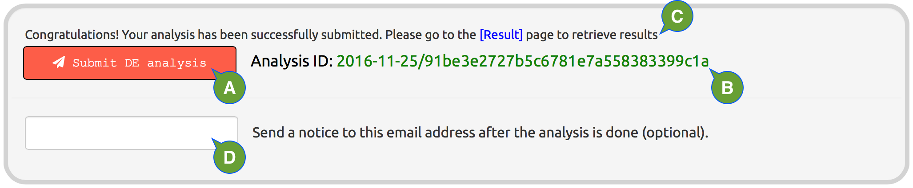

---
output:
  html_document:
    theme: null
    mathjax: null
---

**Submit analysis.**

Submit analysis after all inputs are provided.

  - **A:** click the button to submit the analysis; once one analysis is submitted, users need to refresh the web browser to submit another analysis.
  - **B:** the analysis ID is associated with the analysis result and can be used to retrieve results of previous analyses; a new analysis will be created every time the web browser is refreshed.
  - **C:** a message will show up once the analysis is submitted, to indicate whether the submission is successful. 

