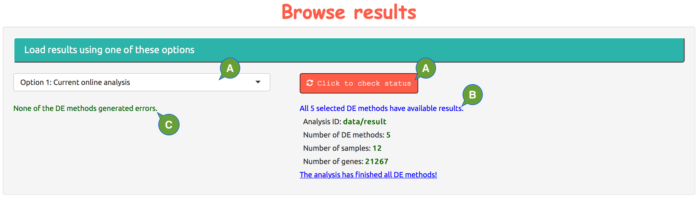

---
output:
  html_document:
    theme: null
    mathjax: null
---

**Load results.**

  - **A:** there are 3 options to load results.
    - **1:** load the available results of the current analysis. 
    - **2:** load the results of a previous analysis by entering an analysis id. 
    - **3:** upload the results from an offline analysis; read [**Run analysis offline**] page for more details.
  - **B:** how many selected methods have been finished and other information about the analysis.
  - **C:** whether there are errors out of the selected methods.

