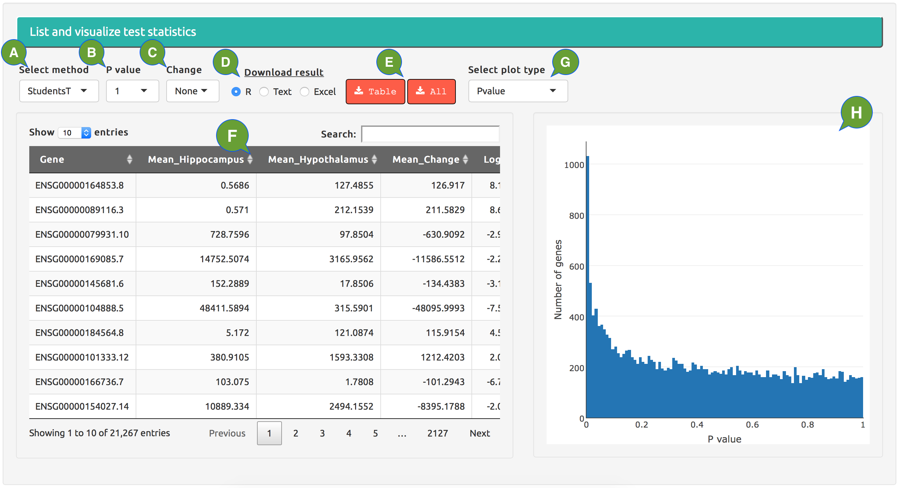

---
output:
  html_document:
    theme: null
    mathjax: null
---

**Result tables.**

  - **A:** select a result table to show; for current analysis, only results of finished DE methods will be available.
  - **B:** filter the result table by p value cutoffs.
  - **C:** filter the result table by fold change of expression levels between groups, towards either direction.
  - **D:** select the format of downloaded file.
  - **E:** just download the current table or all available results from the analysis.
  - **F:** the result table with 6 common columns from all DE methods; see [**Introduction**] -> [**Test statistics**] for more details.

