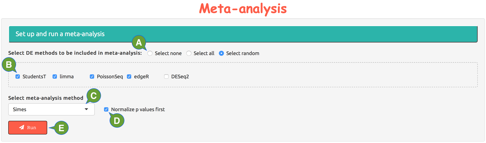

---
output:
  html_document:
    theme: null
    mathjax: null
---

**Set up a meta-analysis.**

Specify the parameters of a meta-analysis

  - **A:** select a subset of available DE methods. Use 'Select random' to get 2 or more random methods.
  - **B:** manually select DE methods to be included in the meta-analysis.
  - **C:** select a method of meta-analysis. Check [metaseqR](https://www.bioconductor.org/packages/release/bioc/html/metaseqR.html) and [Fisher's meta-analysis](https://en.wikipedia.org/wiki/Fisher's_method) for details.
  - **D:** if checked, p values from different DE methods will be normalized (quantile-quantile) first for meta-analysis, so each method will have the same weight in meta-analysis.
  - **E:** run the analysis.

