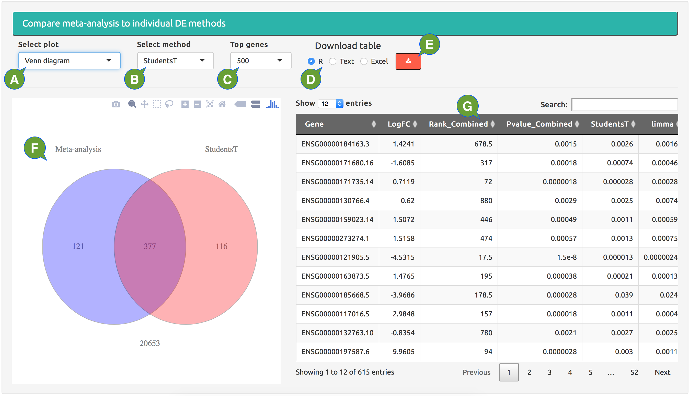

---
output:
  html_document:
    theme: null
    mathjax: null
---

**View meta-analysis result.**

Compare meta-analysis result to result from a single DE method. 

  - **A:** select the type of plot.
  - **B:** select the single DE method to be compared to the meta-analysis.
  - **C:** select a subset of top-ranked genes by the single DE method and meta-analysis.
  - **D:** select the format of file to be downloaded.
  - **E:** download table.
  - **F:** one of these plots: quantile-quantile plot of p values; scatter plot of p value rankings; and Venn diagram of top-gene overlapping. 
  - **G:** results of meta-analysis and p values from DE methods used for the meta-analysis.

