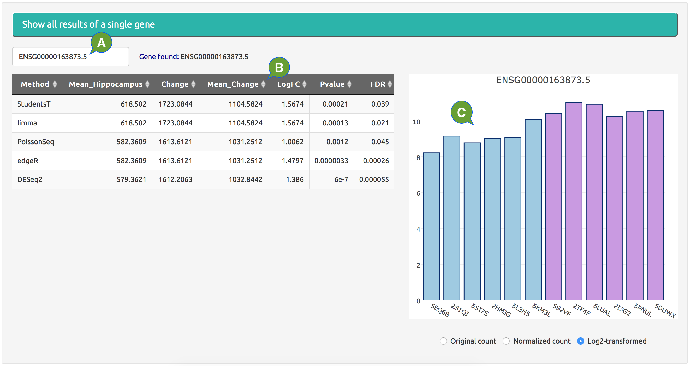

---
output:
  html_document:
    theme: null
    mathjax: null
---

**Single gene.**

Show data and result of a single gene.

  - **A:** enter the row name of a single gene.
  - **B:** results of the gene from all selected DE methods.
  - **C:** the expression level of the gene in all samples, using original read counts, normalized read counts, or log2-transformed data.

