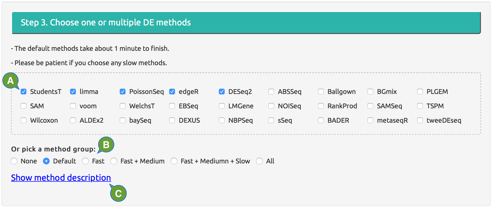
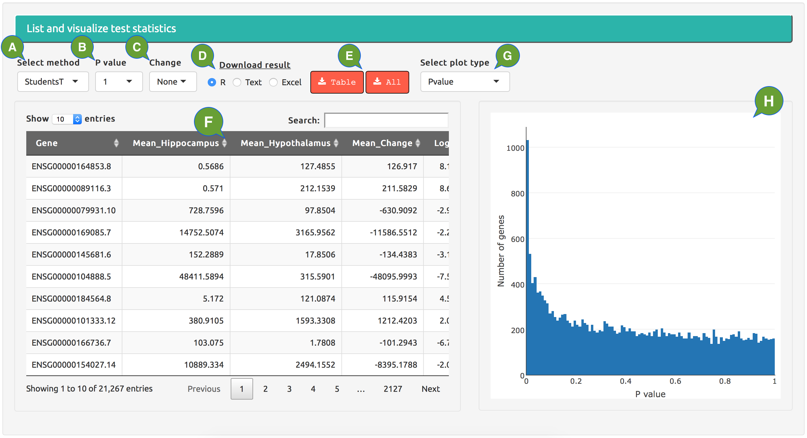

# RNA-seq 2G manual {.tabset}

***Zhe Zhang***

**`r Sys.Date()`**

<div style="padding:0 1cm;"><div style="border:black 1px solid; background:darkgrey; padding: .5cm .5cm"><font color="white">
**RNA-seq 2G** is a web portal with >20 statistical methods that perform two-group analysis of differential gene expression. It uses read count data from RNA-seq or similar data matrix as input and generates test statistics in consistent format as output. 
</font></div> </div>

&nbsp;
  
## Introduction {.tabset}

<div style="color:darkblue">
Two-group comparison of differential expression (DE) is the most common analysis of transcriptome data. For RNA-seq data, the comparison is usually performed on a gene-level matrix of read counts, with the read counts corresponding to the number of sequencing reads mapped to each gene in each RNA-seq sample. 
</div>
&nbsp;

### DE methods

<div style="padding:0 0.5cm;">
Statistical methods that have been applied to two-group DE of RNA-seq data are widely different in terms of their assumptions on data distribution, input/output format, performance, sensitivity, and user-friendliness, which are summarized in the table below:

```{r include=FALSE}
require(knitr);
require(DEGandMore); 
require(awsomics); 
data("DeMethodMeta");

tbl <- data.frame(Name=DeMethodMeta[[1]], Call=rownames(DeMethodMeta), DeMethodMeta[, 2:9], stringsAsFactors = FALSE);
tbl[[1]] <- AddHref(tbl[[1]], DeMethodMeta$Link); 
```

<div style="color:darkblue; padding:0 0cm;">
**Table 1** Analysis methods for differential expression. 

Column description: 

  - **Name**: Method names to be showed on the web portal.
  - **Call**: The names of the re-implemented functions in the [DEGandMore](http://github.com/zhezhangsh/DEGandMore) package. 
  - **Default**: An arbitrarily selected popular DE methods.
  - **Speed**: How much time the DE method takes to finish. Typically, _fast_ methods take a few seconds, _medium_ methods take up to a minute, and _slow_ methods take a few minutes or more. Therefore, the waiting time will be long if any _slow_ methods are selected.
  - **Paired**: Whether the method supports paired test.
  - **Logged**: Wehther the original method is performed on transformed data in logged scale.
  - **Normalization**: Whether the method has its own internal normalization procedure. 
  - **Distribution**: Which data distribution the original method is based upon. 
  - **Test**: The statistical test used by the method. 
  - **Function**: The main function and package within which the method was originally implemented. 
</div>

<div style="padding:0 0cm;">
```{r echo=FALSE, results='asis'}
kable(tbl, row.names = FALSE, format = 'markdown');
```
</div>

</div>

### Test statistics

<div style="padding:0 0.5cm;">
All DE methods available through **RNAseq 2G** report a 6-column table of test statistics. All tables from the same analysis will have the same size and the same number and order of row and column names. The rows are the genes of read count matrix, after filtering for missing values and low read count.

<div style="color:darkblue; padding:0 0cm;">
**Table 2** Example of analysis output from all DE methods, a 6-column table:

Column description: 

  - **Mean_Control** and **Mean_Patient** The group means of normalized read counts, using the internal normalization of the DE method or user-specified normalization if the method doesn't have one. If the DE method uses log-transformed data, the final values in these columns will be un-logged.
  - **Patient-Control**: The different between the first 2 columns. 
  - **LogFC**: The log2-ratio of group means, which is often refered to as _fold change_. For example, when the average read counts of the two groups is 1:4, the log2-ratio equals to 2.0; and when the ratio is 8:1, the log2-ratio will be -3.0. If a DE method has no its own algorithms to calculate log2-ratios, the values will be calculated based on normalized data. Missing values will be replaced with 0. 
  - **Pvalue**: The statistical significance of group difference. This is the column that differs all DE methods as each method has its own assumption about data distribution and choice of statistical test. Missing values in the original result will be replaced by 1.0 in the final table. **RNA-seq 2G** provides online visualization to compare p values from different DE methods side-by-side. 
  - **FDR**: False discovery rate calculated from the p value using the _Benjamini-Hochberg_ method. Although some DE methods also calculate FDRs or other adjusted p values using their own algorithms, they will not be used in this table. Therefore, the values in this column is solely based on the ***Pvalue*** column and calculated the same way for all DE methods. 
</div>

<div style="padding:0 1cm"> 
```{r echo=FALSE, results='asis'}
data(result_example);
tbl <- FormatNumeric(result_example[[2]][[1]][1:16, ]);
kable(tbl, format = 'markdown', row.names = TRUE, align='c');
```
</div>

</div>

## Prepare inputs {.tabset}

<div style="color:darkblue; padding:0 0.5cm;">
For RNA-seq data the raw sequencing reads need to be aligned to the reference genome and transcriptome using any alignment program. Next, the aligned reads should be assigned to annotated genes or transcripts to generate a read count matrix. RNA-seq 2G accepts other types of data, such as those generated by the proteomics and Nanostring technologies, as long as the raw data was processed similarly to generate a integer matrix. 
</div>
&nbsp;

### Read count matrix

<div style="padding:0 0.5cm;">
Using gene-level data from RNA-seq as an example, the read count matrix should have rows corresponding to unique genes and columns corresponding to unique samples, and each cell should be the number of sequencing reads of a sample mapped to a gene. Missing values are allowed, and will be dealt with before the analysis starts. **The row and column names of the matrix must be unique gene and sample IDs respectively.** The type of gene IDs (official symbols, RefSeq, etc.) doesn't matter. **RNA-seq 2G** accepts the read count matrix in different types of files and examples can be downloaded [here](https://github.com/zhezhangsh/awsomics/raw/master/rnaseq_2g/data/count_example.zip).

  - **R file**(***.rds, .rda, or .rdata***) that saves the read count matrix as a matrix or data.frame object.
  - **Tab-delimited text file**(***.txt***) that has the gene IDs in the first column and sample IDs in the first row. 
  - **Comma-delimited text file**(***.csv***) that has the gene IDs in the first column and sample IDs in the first row. 
  - **Excel file**(***.xls or .xlsx***) that has the matrix in the first worksheet and the gene and sample IDs in the first column and row. 
  - **HTML file**(***.htm or .html***) that has the matrix as the first HTML table within the ***table*** tag.
</div>

### Sample grouping

<div style="padding:0 0.5cm;">
Sample IDs should be grouped into two groups to be compared. The sample IDs must match the column names of the read count matrix. The default names of the groups  are ***Control*** and ***Case*** if the they are not explicitly named. **For paired test**, both groups must have the same number of samples and the paired samples must be in the same order.** **RNA-seq 2G** allows users to type in the group names and sample IDs directly or upload a formmated file. Examples of acceptable file formats can be downloaded [here](https://github.com/zhezhangsh/awsomics/raw/master/rnaseq_2g/data/group_example.zip).

  - **R file**(***.rds, .rda, or .rdata***) that is a list of two named character vectors of sample IDs.
  - **Tab-delimited text file**(***.txt***) that includes two lines, both started with group name and followed by sample IDs.
  - **Comma-delimited text file**(***.csv***) that includes two lines, both started with group name and followed by sample IDs.
  - **Excel file**(***.xls or .xlsx***) that includes two rows, both started with group name and followed by sample IDs.
</div>

### Other parameters

<div style="padding:0 0.5cm;">
Users also need to specify a few parameters to run the DE analysis:

 - **Paired**: Whether the comparison is paired. Only applicable to DE methods supporting paired test. The compared groups must have the same number of samples for paired test and the paired samples need to be organized in the same order. 
 - **Missing value**: What to do with missing values. The options are replacing missing values with 0 and removing the genes including any missing values. The imputation option is currently not available, so users need to do it themselves if they want their data imputed. Indeed, it's highly encouraged that users handle the missing values with their favorite strategy beforehand. 
 - **Minimal count**: Genes with total read counts from all samples less than this number will not be included in the result.
 - **Normalization**: How to normalize the read count matrix if the DE method has no its own methods. 

    - **Normalization of read count**: How to normalize read count data. The options are "DESeq", "TMM", "RLE", "QQ", "UpperQuantile", "Median", and "TotalCount".
    
        - **DESeq**: the default normalization method provided the **DESeq2** package.
        - **TMM**: the "trimmed mean of M-values" method provided by the **EdgeR** package.
        - **RLE**: the "relative log expression" method provided by the **EdgeR** package.
        - **QQ**: the quantile-quantile normalization to make all samples have the exactly same distribution.
        - **UpperQuantile**: rescale data so all the samples have the same upper quantile.
        - **Median**: rescale data so all the samples have the same median.
        - **TotalCount**: rescale data so all the samples have the same total number of read counts.
        
    - **Normalization of logged data**: How to normalize data after it's log-transformed. The options are "Loess", "VST", "Rlog", "QQ", "UpperQuantile", and "Median".
    
        - **Loess**: fit pairs of samples to local regression.
        - **VST**: the "variance stabilizing transformation" method provided the **DESeq2** package.
        - **Rlog**: the "regularized log transformation" method provided the **DESeq2** package.
        - **QQ**: the quantile-quantile normalization to make all samples have the exactly same distribution.
        - **UpperQuantile**: rescale data so all the samples have the same median.
        - **Median**: rescale data so all the samples have the same median.
</div>

## Run analysis online {.tabset}

<div style="color:darkblue; padding:0 0.5cm;">
**RNAseq 2G** provides a user-friendly web portal to run a DE analysis using any of the available methods. Each analysis will be assigned a random ID and its results can be re-visited by specifying the ID. To set an analysis go to http://rnaseq2g.awsomics.org and finish 3 simple steps described below within the on the **Analysis** page. 
</div>
&nbsp;

### Step 1

<div style="padding:0 0.5cm;">
<div align='center'>

</div>
<div style="color:darkblue; padding:0 0cm">
**Figure 1A.** Set up online DE analysis, Step 1.

  - **A:** upload a local file of read count matrix in one of the acceptable formats.
  - **B:** click file extension to download an example file in acceptable format. 
  - **C:** once a read count matrix is successfully loaded, the first a few rows will be showed for visual confirmation.
</div>
</div>

### Step 2

<div style="padding:0 0.5cm;">
<div align='center'>

</div>
<div style="color:darkblue; padding:0 0cm">
**Figure 1B.** Set up online DE analysis, Step 2.

  - **A:** upload a local file of sample grouping in an acceptable formats; the group names and sample ID will show up in boxes on the right.
  - **B:** click file extension to download an example file in acceptable format.
  - **C:** group names; can be directly typed in or automatically added through loaded file.
  - **D:** sample IDs; can be directly typed in (separated by commas) or automatically added through loaded file; for paired test, both groups should have the same number of samples and paired samples should be in the same order. 
  - **E:** paired or unpaired test; will be ignored if the DE method doesn't support paired test.
  - **F:** replace missing values with 0 or remove the genes including any missing value.
  - **G:** methods to normalize original read count data and log-transformed data; ignored if the DE method has its own normalization.
  - **H:** genes with total number of reads less than this number will not be included in the results.
</div>
</div>

### Step 3

<div style="padding:0 0.5cm;">
<div align='center'>

</div>
<div style="color:darkblue; padding:0 0cm">
**Figure 1C.** Set up online DE analysis, Step 3.

  - **A:** pick the DE methods to run.
  - **B:** quickly pick a subset of methods to run.
  - **C:** click to show detailed description of all DE methods. 
</div>
</div>

## Run analysis offline {.tabset}

<div style="color:darkblue; padding:0 0.5cm;">
An alternative to use **RNA-seq 2G** is to directly call the ***DeRNAseq {DEGandMore}*** function within R. This option is more suitable for DE analysis runs using any of the slow methods (see **Table 1**). When any slow DE methods are selected, the online waiting might be too long and users should run the DE analysis offline, but can later upload their results to **RNAseq 2G** for visualization. Running the offline analysis  takes some basic R skills and a few simple steps.
</div>
&nbsp;

### Install packages

<div style="padding:0 0.5cm;">
Open RStudio or R console, **make sure the base version of R is 3.2 or higher and have the _devtools_ package installed**, using the code below to find out.

```{r include=TRUE, results='hide', eval=FALSE, echo=TRUE}
version;
if(!require('devtools')) install.packages('devtools'); 
```

Install all required R packages from CRAN, Bioconductor, and GitHub and test if they can be loaded properly using the code below. Depending on how many packages need to be installed, this process might take a while. If everything goes well, you will get a message at the end of screen messages, saying _"Congratulations! All required packages have been installed and loaded."_
  
```{r include=TRUE, results='hide', eval=FALSE, echo=TRUE}
require(devtools);
source_url("https://raw.githubusercontent.com/zhezhangsh/DEGandMore/master/installer.r"); 
```
</div>

### Perform analysis

<div style="padding:0 0.5cm;">
Run DE analysis using the code below based on the **DEGandMore::DeRNAseq** function. 

```{r include=TRUE, results='hide', eval=FALSE, echo=TRUE}
require(RoCA);
require(DEGandMore); 

# Import read count matrix and sample grouping from files; see above for acceptable file formats
read.count   <- ImportTable('my_read_count_file');
sample.group <- ImportList('my_sample_group_file');

# Set up parameters
pr <- FALSE;   # change to TRUE for paired test
md <- 0;       # change to 1-4 for other method groups or specific method names
mc <- 6;       # change to another non-negative integer for a different cutoff
nc <- 1;       # change to 2 or higher if the system supports parallel computing
n1 <- 'DESeq'; # change to "TMM", "RLE", "QQ", "UpperQuantile", "Median", or "TotalCount" to use other methods
n2 <- 'Loess'; # change to "VST", "Rlog", "QQ", "UpperQuantile", or "Median" to use other methods

####################################################################################################
# Run DE analysis
my.analysis.result <- DeRNAseq(ct = read.count, grps = sample.group, mthds = md, paired = pr,
                               min.count = mc, num.cluster = nc, just.stat = TRUE, 
                               norm.count = n1, norm.logged = n2, force.norm = TRUE);
# note that the parameters 'just.stat' and 'force.norm' should always be TRUE for RNAseq 2G
####################################################################################################

# save results to file
saveRDS(my.analysis.result, 'my_analysis_result.rds');
# the 'my_analysis_result.rds' file can now be uploaded to the RNAseq 2G web portal for visualizaiton
```

Alternatively, simply run DE analysis using just 2 specific methods and default parameters.

```{r include=TRUE, results='hide', eval=FALSE, echo=TRUE}
my.analysis.result <- DeRNAseq(read.count, sample.group, c('DeEdgeR', 'DeDeSeq'), force.norm = TRUE);
```
</div>

### List methods

<div style="padding:0 0.5cm;">
Available DE methods and method groups can be found using the code below.

```{r eval=TRUE, echo=FALSE}
options(width=120);
```

```{r eval=TRUE, results="markup"}
DeRNAseqMethods(group=0); # Default methods
DeRNAseqMethods(group=1); # Fast methods
DeRNAseqMethods(group=2); # Fast+medium methods
DeRNAseqMethods(group=3); # Fast+medium+slow methods
DeRNAseqMethods(group=4); # All methods
```
</div>

## Browse results {.tabset}

<div style="color:red; padding:0 0.5cm;">
***TO BE FINISHED***
</div>
&nbsp;

<div style="color:darkblue; padding:0 0.5cm;">
Results of DE analysis can be visualized and compared online via **RNAseq 2G**.
</div>
&nbsp;

<div align='center'>

</div>
<div style="color:darkblue; padding:0 0cm">

</div>

<div align='center'>

</div>
<div style="color:darkblue; padding:0 0cm">

</div>

<div align='center'>

</div>
<div style="color:darkblue; padding:0 0cm">

</div>

<div align='center'>

</div>
<div style="color:darkblue; padding:0 0cm">

</div>

<div align='center'>

</div>
<div style="color:darkblue; padding:0 0cm">

</div>

<div align='center'>

</div>
<div style="color:darkblue; padding:0 0cm">

</div>


---
END OF DOCUMENT

